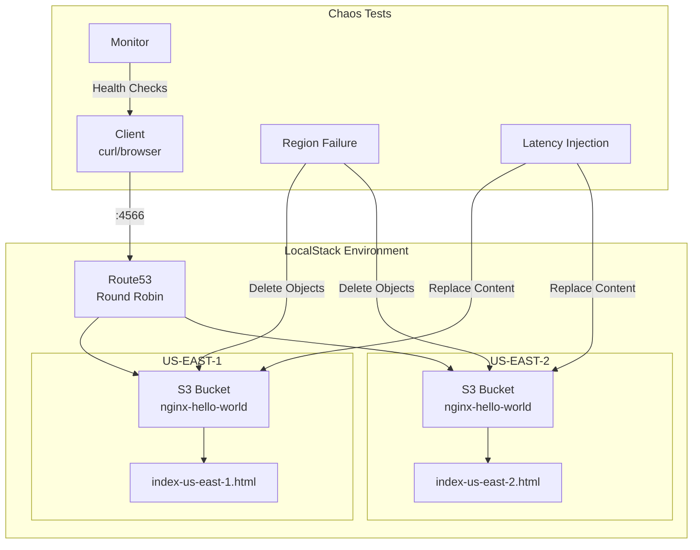
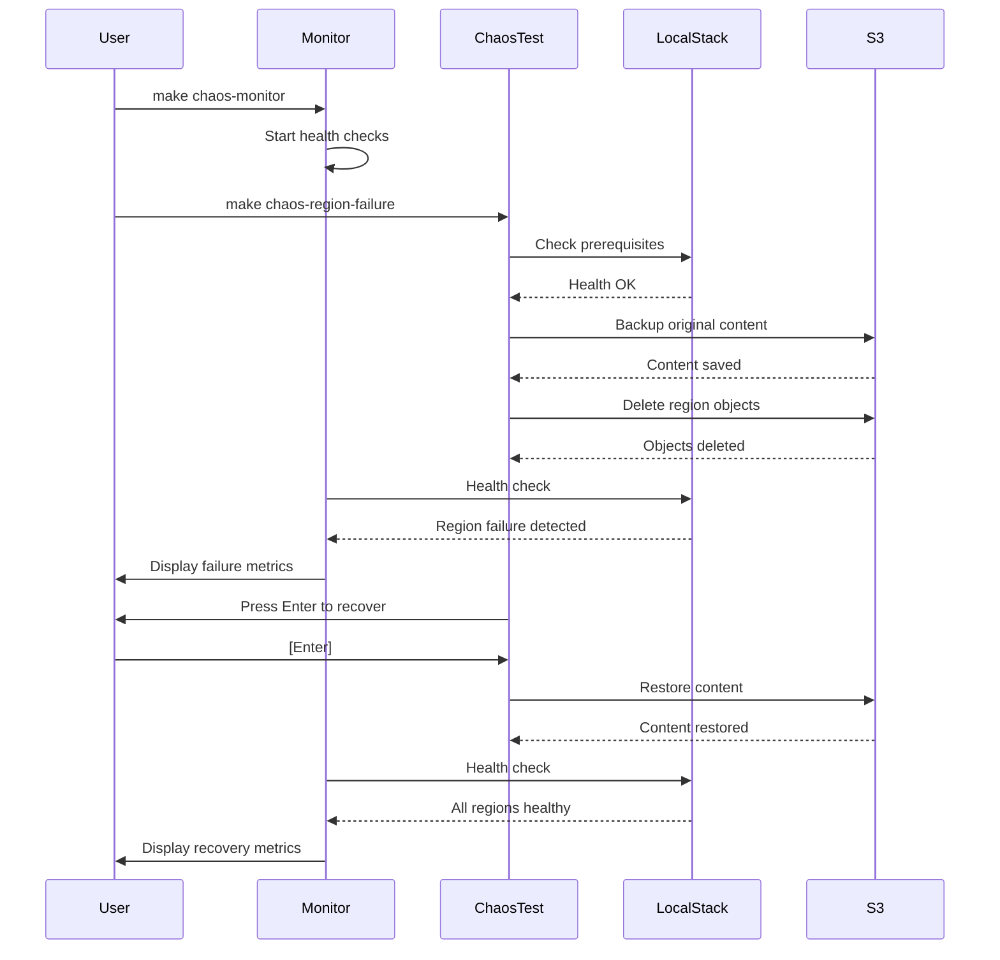
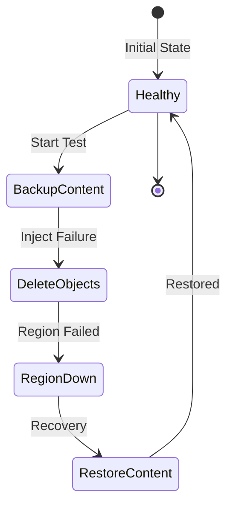
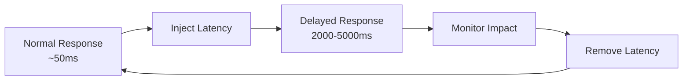
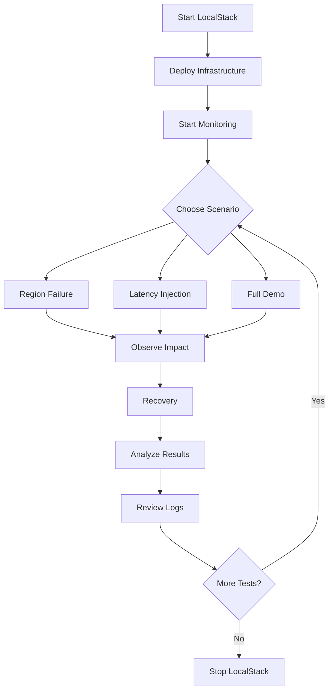

# Chaos Engineering Demo with LocalStack

## 📋 Purpose

This project demonstrates chaos engineering principles using LocalStack to simulate AWS infrastructure locally. It showcases how to test system resilience by intentionally introducing failures and observing system behavior under stress conditions.

### Key Objectives:
- **Learn Chaos Engineering**: Practice failure injection in a safe, local environment
- **Test Resilience**: Verify system behavior when regions fail or experience latency
- **Monitor Recovery**: Observe how systems recover from various failure scenarios
- **AWS Simulation**: Use LocalStack to simulate multi-region AWS deployments without cloud costs

## 🏗️ Architecture Overview



## 🚀 Quick Start

### Prerequisites
- Docker and Docker Compose
- LocalStack Pro license (set as `LOCALSTACK_AUTH_TOKEN` environment variable)
- Python 3.x
- Make
- curl

### Initial Setup

1. **Clone the repository**:
   ```bash
   git clone <repository-url>
   cd chaos-engineering
   ```

2. **Set LocalStack Pro token**:
   ```bash
   export LOCALSTACK_AUTH_TOKEN="your-token-here"
   ```

3. **Start LocalStack**:
   ```bash
   make start
   ```

4. **Deploy infrastructure**:
   ```bash
   make apply
   ```

5. **Verify deployment**:
   ```bash
   curl http://localhost:4566/nginx-hello-world/us-east-1.html
   curl http://localhost:4566/nginx-hello-world/us-east-2.html
   ```

## 📊 Chaos Test Flow



## 🛠️ Available Commands

### LocalStack Management
| Command | Description |
|---------|-------------|
| `make start` | Start LocalStack Pro container |
| `make stop` | Stop LocalStack Pro container |
| `make restart` | Restart LocalStack Pro |
| `make build` | Pull latest LocalStack Pro image |

### Infrastructure Management
| Command | Description |
|---------|-------------|
| `make init` | Initialize Terraform |
| `make plan` | Plan infrastructure changes |
| `make apply` | Deploy nginx to both regions |
| `make destroy` | Remove all infrastructure |

### Chaos Engineering Tests
| Command | Description | Example |
|---------|-------------|---------|
| `make chaos-monitor` | Start monitoring dashboard | `make chaos-monitor` |
| `make chaos-region-failure` | Simulate region failure | `make chaos-region-failure CHAOS_REGION=us-east-2` |
| `make chaos-latency` | Inject network latency | `make chaos-latency CHAOS_REGION=both CHAOS_LATENCY_MS=3000` |
| `make chaos-demo` | Run full demo sequence | `make chaos-demo` |
| `make chaos-help` | Show chaos test help | `make chaos-help` |

## 🧪 Chaos Scenarios

### 1. Region Failure Simulation



**What it tests**: System behavior when an entire AWS region becomes unavailable.

**How it works**:
- Deletes S3 objects to simulate region failure
- Monitors response codes and availability
- Restores content on recovery

### 2. Latency Injection



**What it tests**: System performance under network latency conditions.

**How it works**:
- Replaces content with JavaScript-delayed versions
- Simulates slow network conditions
- Measures impact on user experience

## 📈 Monitoring Dashboard

The monitoring dashboard provides real-time visibility into:
- Response times for each region
- HTTP status codes
- Availability percentages
- Failure counts

```
🔍 Chaos Engineering Monitoring Dashboard
=========================================
[2024-01-10 10:30:45] Check #42
----------------------------------------
✓ US-EAST-1: OK (0.045s)
✗ US-EAST-2: FAILED (HTTP 404)
✓ Main Site: OK (0.052s)

Availability: US-E1: 100.00% | US-E2: 0.00%
```

## 📁 Project Structure

```
chaos-engineering/
├── docker-compose.yml          # LocalStack Pro configuration
├── Makefile                    # Build and test automation
├── terraform/
│   ├── main.tf                # Root Terraform configuration
│   ├── variables.tf           # Terraform variables
│   └── modules/
│       ├── s3-website/        # S3 static hosting module
│       └── route53/           # Route53 configuration
├── chaos-tests/
│   ├── scenarios/             # Chaos test implementations
│   │   ├── region_failure.py  # Region failure simulation
│   │   └── latency_injection.py # Latency injection
│   ├── monitoring/            # Monitoring tools
│   │   └── monitor.sh        # Real-time dashboard
│   ├── reports/              # Test results and logs
│   └── run-chaos-test.sh     # Main test runner
└── index-*.html              # Region-specific content
```

## 🔍 Testing Workflow



## 💡 Best Practices

1. **Always Monitor First**: Start the monitoring dashboard before running chaos tests
   ```bash
   # Terminal 1
   make chaos-monitor
   
   # Terminal 2
   make chaos-region-failure
   ```

2. **Start Small**: Test one region before testing both
   ```bash
   make chaos-region-failure CHAOS_REGION=us-east-1
   ```

3. **Gradual Latency**: Start with small delays and increase gradually
   ```bash
   make chaos-latency CHAOS_LATENCY_MS=500
   make chaos-latency CHAOS_LATENCY_MS=2000
   make chaos-latency CHAOS_LATENCY_MS=5000
   ```

4. **Document Findings**: Check `chaos-tests/reports/` for detailed logs

## 🐛 Troubleshooting

### LocalStack won't start
- Verify `LOCALSTACK_AUTH_TOKEN` is set correctly
- Check Docker is running: `docker ps`
- Review logs: `docker logs localstack-chaos-engineering`

### Terraform apply fails
- Ensure LocalStack is healthy: `make start`
- Check AWS CLI is configured for LocalStack
- Verify S3 bucket creation permissions

### Chaos tests fail
- Confirm infrastructure is deployed: `make apply`
- Check S3 bucket exists and has content
- Verify Python 3 is installed: `python3 --version`

## 📚 Learning Resources

- [Principles of Chaos Engineering](https://principlesofchaos.org/)
- [LocalStack Documentation](https://docs.localstack.cloud/)
- [AWS Well-Architected Framework - Reliability Pillar](https://docs.aws.amazon.com/wellarchitected/latest/reliability-pillar/welcome.html)

## 🤝 Contributing

1. Fork the repository
2. Create a feature branch
3. Add your chaos scenario
4. Submit a pull request

## 📄 License

This project is for educational purposes. See LICENSE file for details.