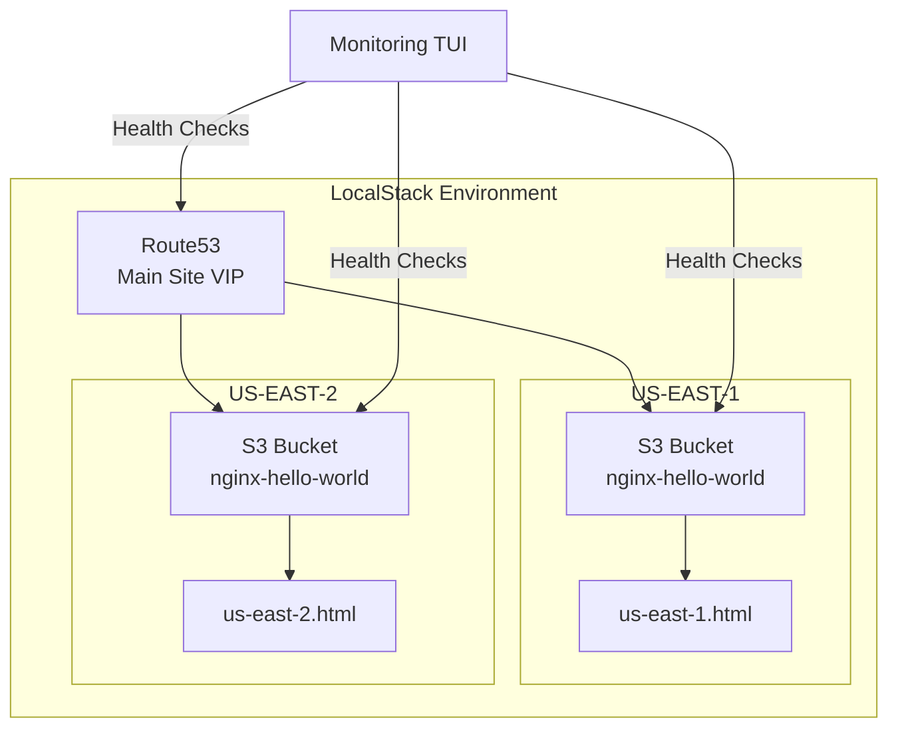

# Chaos Engineering Demo with LocalStack

## 🚀 Quick Start

This project demonstrates chaos engineering principles using LocalStack to simulate AWS infrastructure failures locally.

### Prerequisites
- Docker and Docker Compose
- LocalStack Pro license (set as `LOCALSTACK_AUTH_TOKEN` environment variable)
- Make

### Three Simple Steps

1. **Set up everything**:
   ```bash
   export LOCALSTACK_AUTH_TOKEN="your-token-here"
   make all
   ```
   This command will:
   - Start LocalStack Pro
   - Deploy the infrastructure
   - Set up multi-region nginx servers

2. **Start monitoring** (in a new terminal):
   ```bash
   make chaos-monitor-tui
   ```
   This opens a real-time dashboard showing:
   - Main site status (VIP/Route53)
   - Regional endpoint health (US-EAST-1, US-EAST-2)
   - AWS service status
   - Active chaos configurations

3. **Run chaos tests** (in another terminal):
   ```bash
   make chaos-test-all
   ```
   This runs all 9 chaos scenarios including:
   - Region failures
   - Network latency
   - Service outages
   - API throttling
   - And more...

## 📋 What This Demonstrates

- **Multi-region resilience**: How systems behave when AWS regions fail
- **Network issues**: Impact of latency and network partitions
- **Service failures**: Handling of AWS service outages and throttling
- **Cascading failures**: How failures propagate through dependent services
- **Recovery patterns**: Automatic recovery and failover mechanisms

## 🏗️ Architecture Overview



## 🛠️ Individual Test Commands

If you want to run specific tests instead of the full suite:

### Basic Tests
```bash
# Test single region failure
make chaos-region-failure CHAOS_REGION=us-east-1

# Test both regions failing (main site goes down)
make chaos-region-failure CHAOS_REGION=both

# Inject network latency
make chaos-latency CHAOS_REGION=us-east-2 CHAOS_LATENCY_MS=3000
```

### Advanced Tests (using LocalStack Chaos API)
```bash
# Service outage with 50% failure rate
make chaos-service-outage CHAOS_SERVICE=dynamodb CHAOS_PROBABILITY=0.5

# API rate limiting
make chaos-api-throttling CHAOS_SERVICE=lambda CHAOS_RPS_LIMIT=5

# Test main site failure detection
make chaos-main-site-failure
```

## 📊 Monitoring Options

### Terminal UI Monitor (Recommended)
```bash
make chaos-monitor-tui
```
- Smooth, flicker-free updates
- Comprehensive dashboard
- Shows VIP status and regional health
- Interactive controls (q to quit, r to refresh)

### Alternative Monitors
```bash
# Basic monitoring (simple bash script)
make chaos-monitor

# Advanced monitoring (more details, some flicker)
make chaos-monitor-advanced
```

## 🔍 What to Look For

When running tests, observe:

1. **Main Site Behavior**:
   - Should stay UP when one region fails
   - Should go DOWN when both regions fail
   - Should recover when regions come back

2. **Response Times**:
   - Normal: < 100ms
   - With latency injection: 2000-5000ms
   - During failures: timeouts

3. **Service Status**:
   - ✓ OK/HEALTHY - Service operating normally
   - ⚠ THROTTLED - Rate limiting active
   - ✗ OUTAGE/FAILED - Service unavailable

## 💡 Tips

- Always start the monitor before running tests
- Watch how the main site (VIP) behaves differently from individual regions
- Check the `chaos-tests/reports/` directory for detailed logs
- Use Ctrl+C to stop tests early if needed

## 🐛 Troubleshooting

### LocalStack won't start
```bash
# Check if token is set
echo $LOCALSTACK_AUTH_TOKEN

# Check Docker
docker ps

# View logs
docker logs localstack-chaos-engineering
```

### Monitor shows everything as FAILED
```bash
# Ensure infrastructure is deployed
make apply

# Check S3 bucket contents
curl http://localhost:4566/nginx-hello-world/index.html
```

### Tests fail to run
```bash
# Check prerequisites
make chaos-help

# Clean up and restart
make stop
make start
make apply
```

## 📚 Learn More

- Run `make chaos-help` for detailed command documentation
- Check `chaos-tests/scenarios/` for test implementations
- Visit [LocalStack Chaos Engineering docs](https://docs.localstack.cloud/user-guide/chaos-engineering/)

## 🤝 Quick Cleanup

When you're done:
```bash
make stop
```

This stops LocalStack and cleans up all resources.