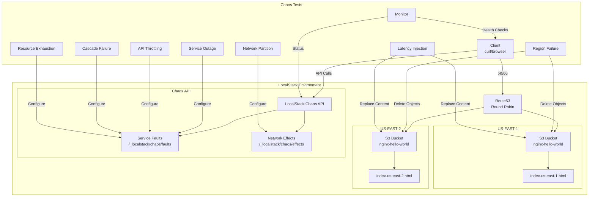
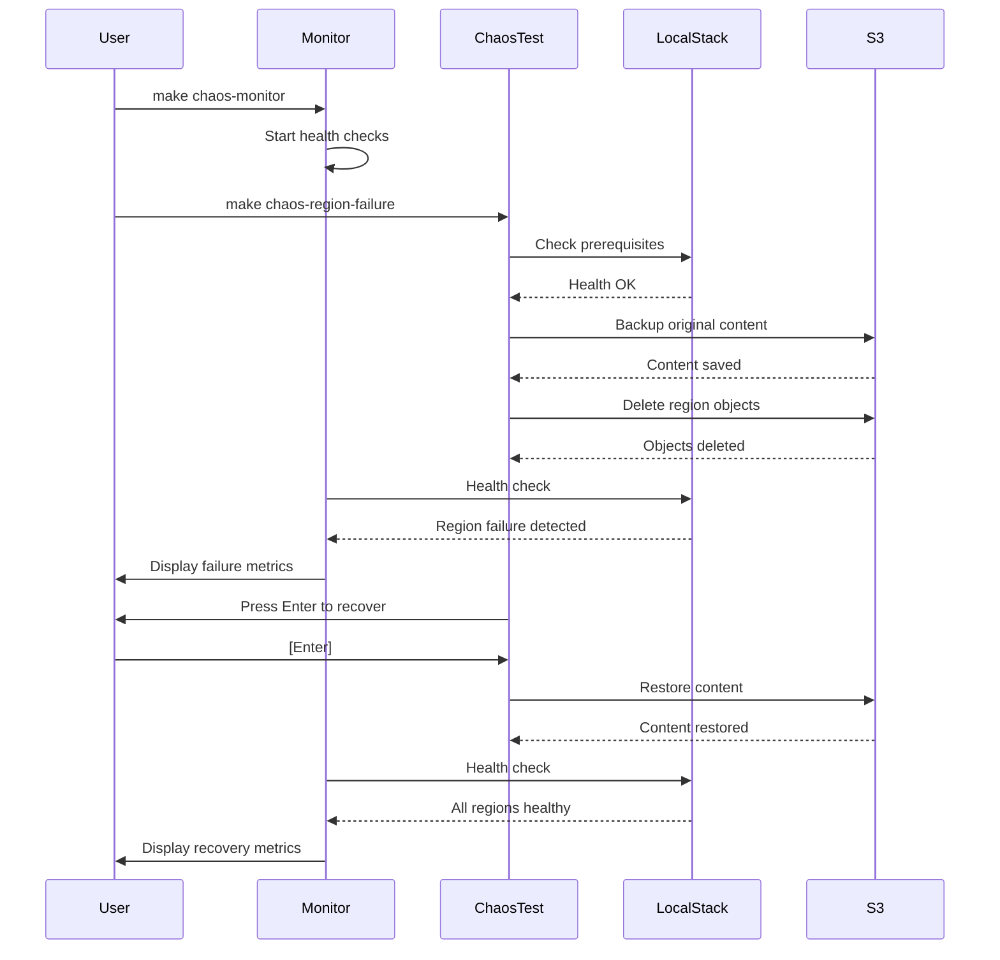
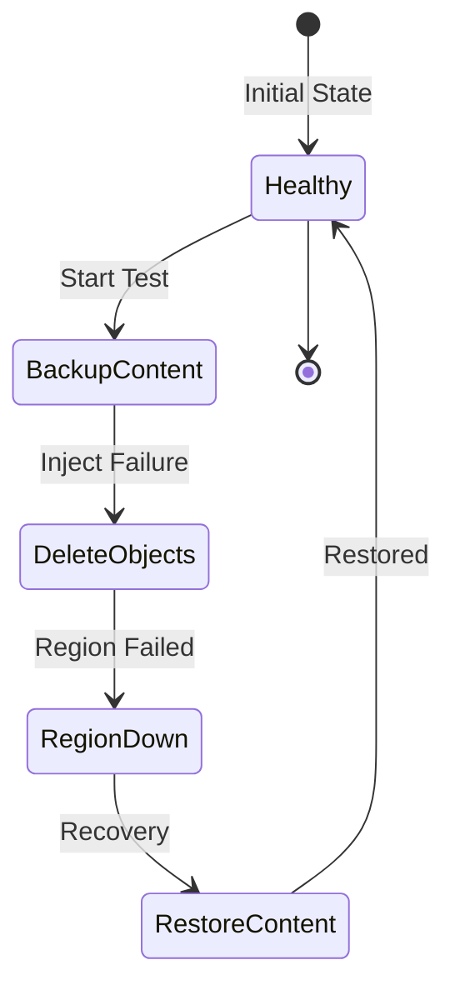
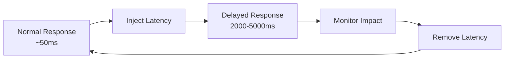
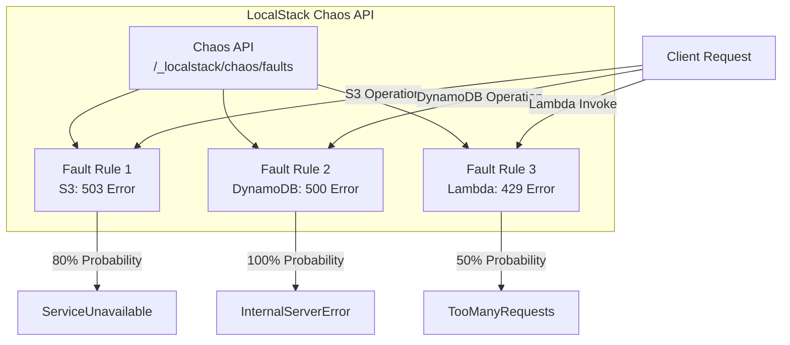
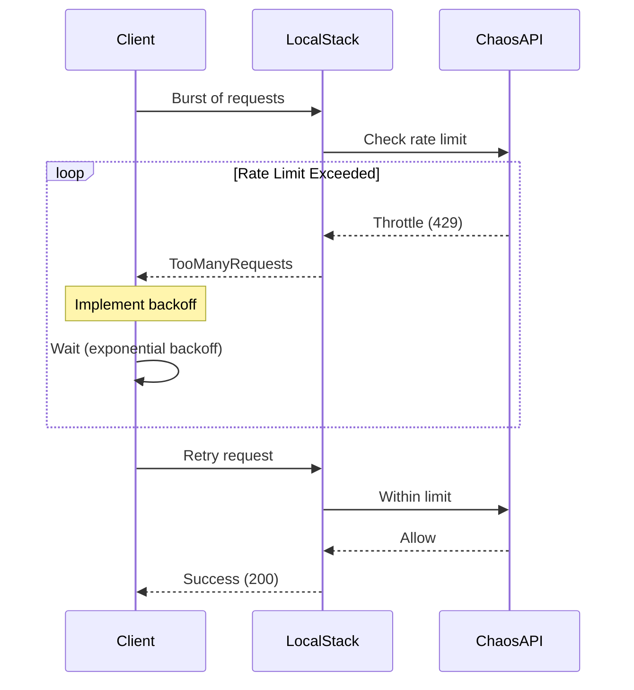
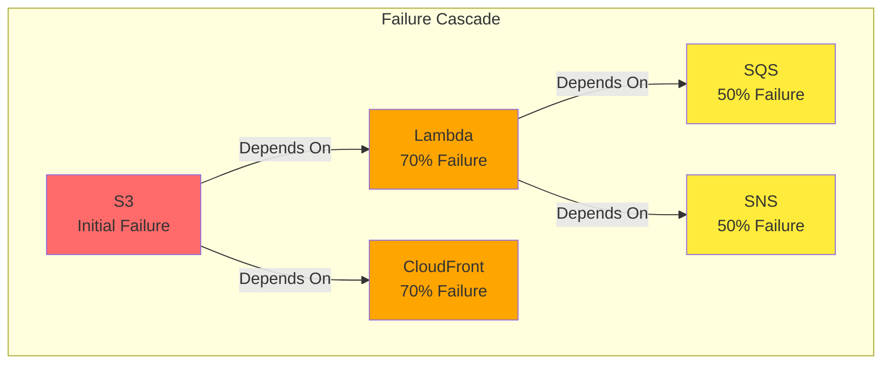
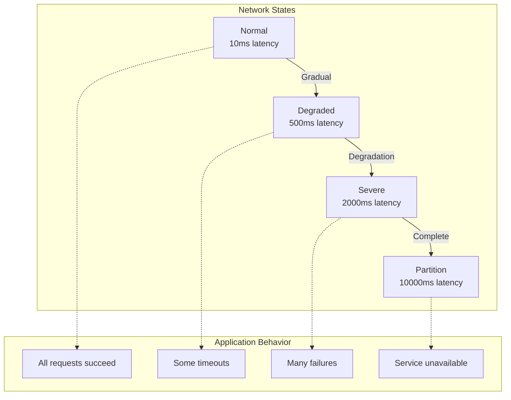
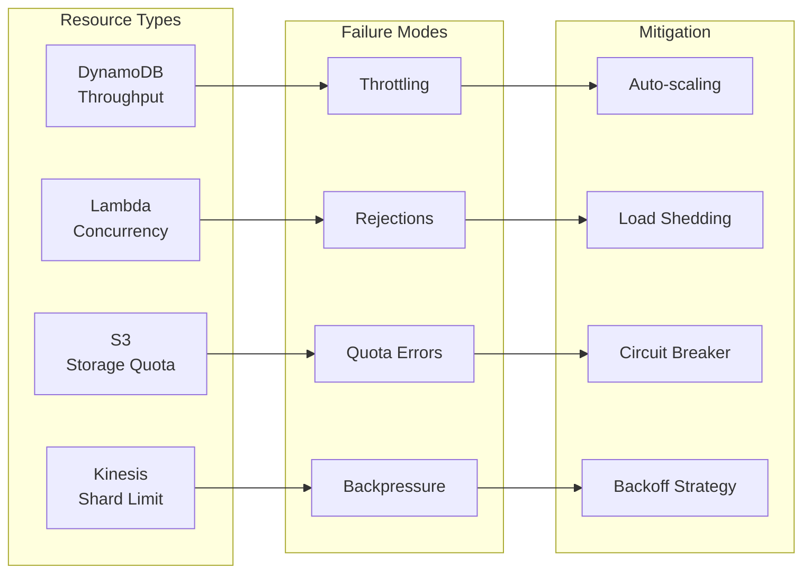
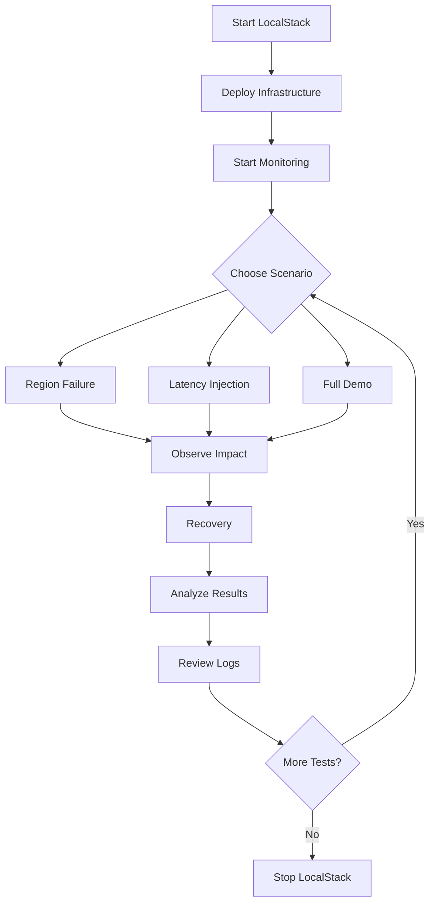

# Chaos Engineering Demo with LocalStack

## 📋 Purpose

This project demonstrates chaos engineering principles using LocalStack to simulate AWS infrastructure locally. It showcases how to test system resilience by intentionally introducing failures and observing system behavior under stress conditions.

### Key Objectives:
- **Learn Chaos Engineering**: Practice failure injection in a safe, local environment
- **Test Resilience**: Verify system behavior when regions fail or experience latency
- **Monitor Recovery**: Observe how systems recover from various failure scenarios
- **AWS Simulation**: Use LocalStack to simulate multi-region AWS deployments without cloud costs

## 🏗️ Architecture Overview



## 🔧 LocalStack Chaos API

LocalStack provides a powerful Chaos API that enables advanced failure injection beyond basic infrastructure manipulation. The API consists of two main endpoints:

### Service Faults (`/_localstack/chaos/faults`)
Inject application-level failures for specific AWS services:
- **Service-specific failures**: Target S3, DynamoDB, Lambda, etc.
- **Configurable probability**: Set failure rates from 0% to 100%
- **Custom error codes**: Return specific HTTP status codes
- **Operation-level targeting**: Fail specific API operations

Example configuration:
```json
{
  "service": "dynamodb",
  "region": "us-east-1",
  "probability": 0.5,
  "error": {
    "statusCode": 429,
    "code": "ProvisionedThroughputExceededException",
    "message": "Throughput exceeded"
  }
}
```

### Network Effects (`/_localstack/chaos/effects`)
Introduce network-level disruptions:
- **Latency injection**: Add delays to all connections
- **Simulates real network issues**: Test timeout handling
- **Global impact**: Affects all services uniformly

Example configuration:
```json
{
  "latency": 2000  // 2 second delay
}
```

## 🚀 Quick Start

### Prerequisites
- Docker and Docker Compose
- LocalStack Pro license (set as `LOCALSTACK_AUTH_TOKEN` environment variable)
- Python 3.x
- Make
- curl

### Initial Setup

1. **Clone the repository**:
   ```bash
   git clone <repository-url>
   cd chaos-engineering
   ```

2. **Set LocalStack Pro token**:
   ```bash
   export LOCALSTACK_AUTH_TOKEN="your-token-here"
   ```

3. **Start LocalStack**:
   ```bash
   make start
   ```

4. **Deploy infrastructure**:
   ```bash
   make apply
   ```

5. **Verify deployment**:
   ```bash
   curl http://localhost:4566/nginx-hello-world/us-east-1.html
   curl http://localhost:4566/nginx-hello-world/us-east-2.html
   ```

## 📊 Chaos Test Flow



## 🛠️ Available Commands

### LocalStack Management
| Command | Description |
|---------|-------------|
| `make start` | Start LocalStack Pro container |
| `make stop` | Stop LocalStack Pro container |
| `make restart` | Restart LocalStack Pro |
| `make build` | Pull latest LocalStack Pro image |

### Infrastructure Management
| Command | Description |
|---------|-------------|
| `make init` | Initialize Terraform |
| `make plan` | Plan infrastructure changes |
| `make apply` | Deploy nginx to both regions |
| `make destroy` | Remove all infrastructure |

### Basic Chaos Tests
| Command | Description | Example |
|---------|-------------|---------|
| `make chaos-monitor` | Start monitoring dashboard | `make chaos-monitor` |
| `make chaos-monitor-advanced` | Advanced monitoring with Chaos API status | `make chaos-monitor-advanced` |
| `make chaos-region-failure` | Simulate region failure | `make chaos-region-failure CHAOS_REGION=us-east-2` |
| `make chaos-latency` | Inject network latency | `make chaos-latency CHAOS_REGION=both CHAOS_LATENCY_MS=3000` |

### Advanced Chaos Tests (LocalStack Chaos API)
| Command | Description | Example |
|---------|-------------|---------|
| `make chaos-service-outage` | Simulate service failures | `make chaos-service-outage CHAOS_SERVICE=dynamodb CHAOS_PROBABILITY=0.5` |
| `make chaos-api-throttling` | Test rate limiting | `make chaos-api-throttling CHAOS_SERVICE=lambda CHAOS_RPS_LIMIT=5` |
| `make chaos-cascade-failure` | Cascading service failures | `make chaos-cascade-failure CHAOS_SERVICE=s3` |
| `make chaos-network-partition` | Network partition simulation | `make chaos-network-partition CHAOS_NETWORK_LATENCY=5000` |
| `make chaos-network-gradual` | Gradual network degradation | `make chaos-network-gradual` |
| `make chaos-network-extreme` | Extreme partition (10s latency) | `make chaos-network-extreme` |
| `make chaos-resource-exhaustion` | Resource limit simulation | `make chaos-resource-exhaustion CHAOS_SERVICE=dynamodb CHAOS_RESOURCE_TYPE=throughput` |

### Utility Commands
| Command | Description | Details |
|---------|-------------|---------|
| `make chaos-demo` | Quick demo of all 7 scenarios | Auto-runs with reduced durations |
| `make chaos-test-all` | Run ALL scenarios comprehensively | Full test suite (15-20 min) |
| `make chaos-test-suite` | Interactive test menu | Select specific scenarios to run |
| `make chaos-help` | Show detailed help | Lists all commands with examples |

## 🧪 Chaos Scenarios

### 1. Region Failure Simulation



**What it tests**: System behavior when an entire AWS region becomes unavailable.

**How it works**:
- Deletes S3 objects to simulate region failure
- Monitors response codes and availability
- Restores content on recovery

### 2. Latency Injection



**What it tests**: System performance under network latency conditions.

**How it works**:
- Replaces content with JavaScript-delayed versions
- Simulates slow network conditions
- Measures impact on user experience

### 3. Service Outage (Chaos API)



**What it tests**: Application resilience to service-specific failures.

**How it works**:
- Uses LocalStack Chaos API to inject service faults
- Configurable failure probability and error codes
- Tests error handling and retry logic

### 4. API Throttling



**What it tests**: Rate limiting behavior and backoff strategies.

**How it works**:
- Simulates API rate limits for various services
- Tests exponential backoff implementation
- Validates circuit breaker patterns

### 5. Cascade Failure



**What it tests**: How failures propagate through dependent services.

**How it works**:
- Starts with single service failure
- Simulates cascading failures in dependent services
- Tests system-wide resilience and recovery patterns

### 6. Network Partition



**What it tests**: Network partition tolerance and timeout handling.

**How it works**:
- Uses Chaos API to inject network latency
- Simulates various network conditions
- Tests timeout configurations and failover logic

### 7. Resource Exhaustion



**What it tests**: System behavior under resource constraints.

**How it works**:
- Simulates various resource exhaustion scenarios
- Tests auto-scaling and backpressure handling
- Validates graceful degradation strategies

## 📈 Monitoring Dashboard

### Basic Monitoring
The basic monitoring dashboard tracks nginx availability:
- Response times for each region
- HTTP status codes
- Availability percentages
- Failure counts

```
🔍 Chaos Engineering Monitoring Dashboard
=========================================
[2024-01-10 10:30:45] Check #42
----------------------------------------
✓ US-EAST-1: OK (0.045s)
✗ US-EAST-2: FAILED (HTTP 404)
✓ Main Site: OK (0.052s)

Availability: US-E1: 100.00% | US-E2: 0.00%
```

### Advanced Monitoring
The advanced monitoring dashboard (`make chaos-monitor-advanced`) provides:
- Active Chaos API configurations
- Service-specific health status
- Failure type detection (throttling, outage, exhaustion)
- Real-time tips for mitigation

```
🔍 Advanced Chaos Engineering Monitoring Dashboard
==================================================
Active Chaos Configurations:
----------------------------
Service Faults:
{
  "id": "fault-123",
  "service": "dynamodb",
  "probability": 0.8,
  "error": {
    "statusCode": 429,
    "code": "ProvisionedThroughputExceededException"
  }
}

Service Health Status:
---------------------
s3:          ✓ Healthy        (0.045s)
dynamodb:    ⚠ Throttled      (0.123s)
lambda:      ✗ Outage         (timeout)

Cumulative Statistics:
--------------------
s3:          Availability:  98.5% | OK:  197 | Throttled:   2 | Outage:   1
dynamodb:    Availability:  60.0% | OK:  120 | Throttled:  76 | Outage:   4
lambda:      Availability:  85.0% | OK:  170 | Throttled:  15 | Outage:  15

💡 Tips:
  - Throttling detected: Implement exponential backoff
  - Service outage detected: Check circuit breaker implementation
```

## 📁 Project Structure

```
chaos-engineering/
├── docker-compose.yml          # LocalStack Pro configuration
├── Makefile                    # Build and test automation
├── terraform/
│   ├── main.tf                # Root Terraform configuration
│   ├── variables.tf           # Terraform variables
│   └── modules/
│       ├── s3-website/        # S3 static hosting module
│       └── route53/           # Route53 configuration
├── chaos-tests/
│   ├── scenarios/             # Chaos test implementations
│   │   ├── region_failure.py  # Region failure simulation
│   │   └── latency_injection.py # Latency injection
│   ├── monitoring/            # Monitoring tools
│   │   └── monitor.sh        # Real-time dashboard
│   ├── reports/              # Test results and logs
│   └── run-chaos-test.sh     # Main test runner
└── index-*.html              # Region-specific content
```

## 🔍 Testing Workflow



## 💡 Best Practices

1. **Always Monitor First**: Start the monitoring dashboard before running chaos tests
   ```bash
   # Terminal 1 - For basic tests
   make chaos-monitor
   
   # OR for advanced tests
   make chaos-monitor-advanced
   
   # Terminal 2
   make chaos-service-outage
   ```

2. **Start Small**: Test single services before complex scenarios
   ```bash
   # Start with single region
   make chaos-region-failure CHAOS_REGION=us-east-1
   
   # Then test both regions
   make chaos-region-failure CHAOS_REGION=both
   
   # Start with low failure probability
   make chaos-service-outage CHAOS_PROBABILITY=0.2
   
   # Increase gradually
   make chaos-service-outage CHAOS_PROBABILITY=0.8
   ```

3. **Test Progressive Failures**: Use gradual degradation modes
   ```bash
   # Test gradual network degradation
   make chaos-network-gradual
   
   # Test increasing latency
   make chaos-latency CHAOS_LATENCY_MS=500
   make chaos-latency CHAOS_LATENCY_MS=2000
   make chaos-latency CHAOS_LATENCY_MS=5000
   ```

4. **Combine Scenarios**: Test realistic failure combinations
   ```bash
   # Terminal 1: Network latency
   make chaos-network-partition CHAOS_NETWORK_LATENCY=1000
   
   # Terminal 2: Service throttling
   make chaos-api-throttling CHAOS_SERVICE=dynamodb
   ```

5. **Document Findings**: 
   - Check `chaos-tests/reports/` for detailed logs
   - Note system behavior under each scenario
   - Document recovery times and patterns

## 🐛 Troubleshooting

### LocalStack won't start
- Verify `LOCALSTACK_AUTH_TOKEN` is set correctly
- Check Docker is running: `docker ps`
- Review logs: `docker logs localstack-chaos-engineering`

### Terraform apply fails
- Ensure LocalStack is healthy: `make start`
- Check AWS CLI is configured for LocalStack
- Verify S3 bucket creation permissions

### Chaos tests fail
- Confirm infrastructure is deployed: `make apply`
- Check S3 bucket exists and has content
- Verify Python 3 is installed: `python3 --version`

## 📚 Learning Resources

- [Principles of Chaos Engineering](https://principlesofchaos.org/)
- [LocalStack Documentation](https://docs.localstack.cloud/)
- [AWS Well-Architected Framework - Reliability Pillar](https://docs.aws.amazon.com/wellarchitected/latest/reliability-pillar/welcome.html)

## 🤝 Contributing

1. Fork the repository
2. Create a feature branch
3. Add your chaos scenario
4. Submit a pull request

## 📄 License

This project is for educational purposes. See LICENSE file for details.